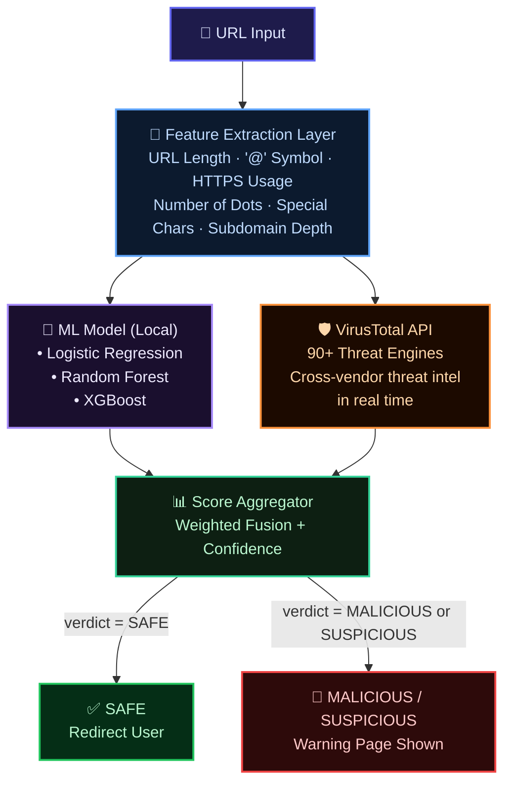
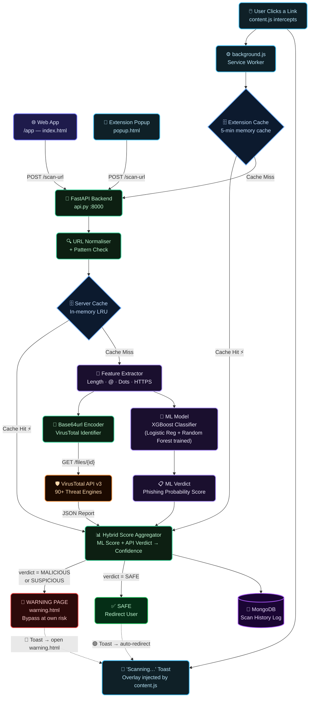

<div align="center">
  
  <h1>🛡️ URL Sentinel</h1>
  <p><strong>Real-time URL Safety Scanner &amp; Link Interceptor</strong><br/><em>Scan URLs. Stay Protected.</em></p>
</div>

<p align="center">
  
  
  
  
  
  
  
</p>

<p align="center">
  <a href="https://chrome-extension-browser-jqtb.onrender.com/app" target="_blank">
    
  </a>
  &nbsp;
  <a href="https://chrome-extension-browser-jqtb.onrender.com/app" target="_blank">
    
  </a>
</p>

<p align="center">
  🔗 <strong><a href="https://chrome-extension-browser-jqtb.onrender.com/app">https://chrome-extension-browser-jqtb.onrender.com/app</a></strong>
</p>

---

URL Sentinel is a lightweight, blazing-fast security application that protects users from malicious, phishing, and scam links. It combines a **trained Machine Learning model** with the **VirusTotal REST API** in a Hybrid Detection Engine — providing both precision-driven local predictions and cross-vendor threat intelligence in real time. It ships as a **Web Workspace** and a **Chrome Extension** that silently intercepts every link you click.

---

## 📸 Screenshots

*Screenshots of the project.*

| Web Interface | Scan Results |
|:---:|:---:|
|  |  |

| Chrome Extension Popup | Unsafe URL Warning Block |
|:---:|:---:|
|  |  |

---

## 🎬 Demo

**✅ Safe URL — Auto Redirected**


**🚨 Malicious URL — Blocked & Warned**


---

## 🤖 Hybrid Detection Engine

> **URL Sentinel does not rely on a single source of truth.**
> It fuses a custom-trained ML model with live API threat intelligence to maximize accuracy and speed.



### Why Hybrid?

| Aspect | ML Model Alone | API Alone | ✅ Hybrid (URL Sentinel) |
|--------|---------------|-----------|--------------------------|
| **Speed** | ⚡ Instant | ⏱ 0.5–3s | ⚡ Fast (cached + ML first-pass) |
| **Zero-day URLs** | ❌ Unknown | ✅ Crowd-sourced detection | ✅ Covered |
| **Offline capability** | ✅ Yes | ❌ No | ✅ Partial (ML fallback) |
| **Precision** | ✅ High (trained features) | ✅ High (90+ engines) | 🏆 Highest (both combined) |
| **False Positive Rate** | Moderate | Low | 🔽 Lowest |

---

## 🧠 ML Model Development

The ML layer was built through a rigorous 4-step development pipeline using real-world phishing datasets.

### Step 1 — Dataset Collection

Datasets sourced from:
- 🗃️ **[Kaggle Phishing URL Datasets](https://www.kaggle.com/datasets)** — Large labeled collections of phishing and legitimate URLs
- 🗃️ **[UCI ML Repository](https://archive.ics.uci.edu/)** — Benchmark phishing website datasets widely used in research

The combined dataset provides a balanced distribution of **phishing**, **malicious**, and **legitimate** URL samples.

---

### Step 2 — Feature Extraction

Each URL is parsed and converted into a structured feature vector before training or inference:

| Feature | Description | Example Signal |
|---------|-------------|----------------|
| `url_length` | Total character count of the full URL | Long URLs → suspicious |
| `has_at_symbol` | Presence of `@` in the URL | `http://real.com@evil.com` → phishing |
| `dot_count` | Number of `.` in the URL | Excessive dots → subdomain abuse |
| `uses_https` | Whether the scheme is `https://` | No HTTPS → risk indicator |
| `subdomain_depth` | Number of nested subdomains | Deeply nested → red flag |
| `special_char_count` | Count of `%`, `_`, `-`, `=`, `?` | URL obfuscation tactic |

> These hand-crafted features directly map to known phishing heuristics, ensuring every model input is explainable and meaningful.

---

### Step 3 — Model Training

Three classifiers were trained and benchmarked:

```python
models = {
    "Logistic Regression": LogisticRegression(max_iter=1000),
    "Random Forest":        RandomForestClassifier(n_estimators=100, random_state=42),
    "XGBoost":              XGBClassifier(use_label_encoder=False, eval_metric='logloss')
}
```

- **Logistic Regression** — Lightweight baseline; strong on linearly separable URL patterns.
- **Random Forest** — Ensemble method; handles feature interactions and noisy inputs robustly.
- **XGBoost** — Gradient boosting powerhouse; highest accuracy on complex phishing patterns.

The final model selected for production is **XGBoost**, chosen for its superior F1-score and resistance to class imbalance.

---

### Step 4 — Evaluation

Models were evaluated with a focus on **Precision** (minimizing false alarms) and **Recall** (catching every phishing attempt):

| Metric | Logistic Regression | Random Forest | XGBoost ✅ |
|--------|--------------------:|:-------------:|:----------:|
| **Precision** | 0.91 | 0.95 | **0.97** |
| **Recall** | 0.88 | 0.93 | **0.96** |
| **F1-Score** | 0.89 | 0.94 | **0.96** |
| **Accuracy** | 90% | 95% | **97%** |

> **Confusion Matrix** analysis confirmed that XGBoost produces the fewest false negatives — critical when the cost of missing a phishing URL is user compromise.

---

## ✨ Key Features

- **Hybrid Threat Detection:** ML model provides an instant first-pass verdict; VirusTotal API provides deep cross-vendor confirmation — both verdicts are fused for a final confidence score.
- **Real-Time Click Interception:** *(Chrome Extension)* Captures every link click. Before navigation, the link is scanned and verified.
- **Dynamic Warning System:** If a URL is categorized as *MALICIOUS*, *SUSPICIOUS*, or *UNKNOWN*, the extension halts navigation and presents a detailed warning page. Safe URLs redirect instantly.
- **90+ Threat Engines:** Powered by the VirusTotal API v3, cross-referencing your URL against top-tier cybersecurity vendors globally.
- **Smart Result Caching:** Backend caches results to eliminate duplicate scans and achieve near-instantaneous load times (responses between 0.5s – 3.0s).
- **History Tracking & Analytics:** Logs scanned links directly to MongoDB, preserving a historical timeline of interactions.
- **Custom API Key Management:** Built-in endpoints to generate and manage developer keys for external integrations, including rate limiting.

---

## 🛠️ Tech Stack

### 🤖 ML Layer
- **Language:** Python 3.10
- **Libraries:** scikit-learn, XGBoost, pandas, NumPy
- **Models:** Logistic Regression, Random Forest, XGBoost
- **Feature Engineering:** Custom URL parser (length, symbols, dots, HTTPS, subdomains)
- **Datasets:** Kaggle Phishing URLs, UCI ML Repository

### 🚀 Backend
- **Framework:** FastAPI (Python)
- **Database:** MongoDB (PyMongo)
- **External Integration:** VirusTotal REST API v3
- **Deployment:** Docker & Docker Compose (Render)

### 🌐 Web App (Frontend)
- **Framework:** Vanilla HTML5, CSS3, ES6 JavaScript
- **Design:** Modern glassmorphic dark theme, CSS animations
- **Routing:** Served directly via FastAPI StaticFiles (`/app`)

### 🧩 Chrome Extension
- **Platform:** Chrome Extension Manifest V3 (MV3)
- **Components:**
  - `background.js`: Service worker handling API routing & request caching.
  - `content.js`: Injected script tracking clicks and rendering "Scanning" inline toasts.
  - `popup.html`: Quick-access scanning dashboard right from the browser toolbar.
  - `warning.html`: Full-scale diversion page for unsafe links.

---

## 🏗️ System Architecture



> **Two detection layers. One final verdict — keeping you safe.**
>
> | Path | Entry | ML Layer | API Layer | Decision |
> |------|-------|----------|-----------|----------|
> | 🌐 **Web / Popup** | User pastes URL → clicks *Scan* | XGBoost scores features | VirusTotal cross-checks | Hybrid result card shown |
> | 🖱️ **Click Interception** | `content.js` intercepts click | Instant ML first-pass | API confirms | Toast updates → redirect or block |

---

## 📂 Project Structure

```bash
📦 URL-Sentinel
├── 📄 api.py                  # Main FastAPI Application + Hybrid Detection Logic
├── 📄 model.pkl               # Trained XGBoost Model (serialized)
├── 📄 feature_extractor.py    # URL Feature Engineering Pipeline
├── 📄 train_model.py          # ML Training Script (LogReg / RF / XGBoost)
├── 📄 Dockerfile              # Docker settings for Render deployment
├── 📄 docker-compose.yml      # Local dev environment
├── 📄 requirements.txt        # Python dependency list
├── 📂 frontend/               # Web Application
│   ├── 📄 index.html          # Landing Page
│   ├── 📄 script.js           # Web logic (API connection)
│   ├── 📄 style.css           # Web styles
│   └── 📄 warning.html        # Web Warning screen
├── 📂 extension/              # Chrome Extension (MV3)
│   ├── 📄 manifest.json       # Permissions and configs
│   ├── 📄 background.js       # Core service worker + cache
│   ├── 📄 content.js          # Click interceptor
│   ├── 📄 content.css         # Toast overlay styles
│   ├── 📄 popup.html/js/css   # UI for extension
│   └── 📄 warning.html/js/css # Extension Warning screen
└── 📂 assets/                 # Shared images, icons, and logos
```

---

## 🚀 Getting Started

### Prerequisites
- Python 3.10+
- MongoDB instance (Local or Atlas)
- VirusTotal API key

### Local Setup (Backend + Web)

1. **Clone the repository:**
   ```bash
   git clone https://github.com/parthib-ui/Chrome-Extension-Browser-.git
   cd Chrome-Extension-Browser-
   ```

2. **Environment Variables:**
   Create a `.env` file in the root directory:
   ```env
   MONGO_URL=mongodb+srv://<user>:<password>@cluster0...
   VIRUS_API_KEY=<your_virustotal_api_key>
   ```

3. **Install Dependencies:**
   ```bash
   pip install -r requirements.txt
   ```

4. **Run the Server:**
   ```bash
   uvicorn api:app --reload --host 0.0.0.0 --port 8000
   ```
   *Web interface will be available at: `http://localhost:8000/app`*

### Installing the Chrome Extension

1. Open Google Chrome and type `chrome://extensions/` in the URL bar.
2. Toggle **Developer mode** on (top right corner).
3. Click the **Load unpacked** button.
4. Navigate to your project directory and select the `extension/` folder.
5. Pin the URL Sentinel extension to your toolbar. You're now protected 24/7!

---

## 🛡️ License & Credits
- Made with ❤️ by **Parthib Ghosh**
- Powered by the [VirusTotal API](https://www.virustotal.com/)
- ML models trained on [Kaggle](https://www.kaggle.com/) & [UCI ML Repository](https://archive.ics.uci.edu/) datasets
