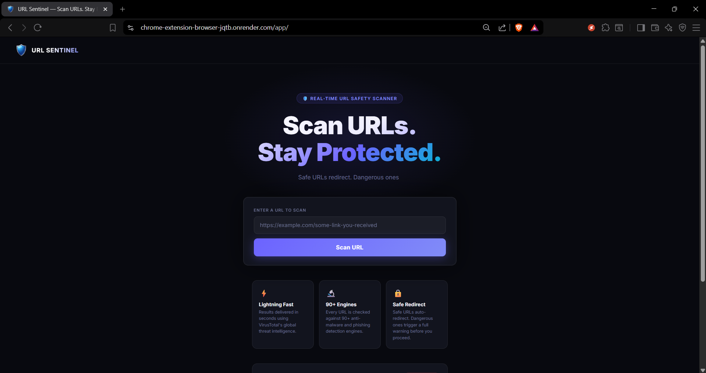
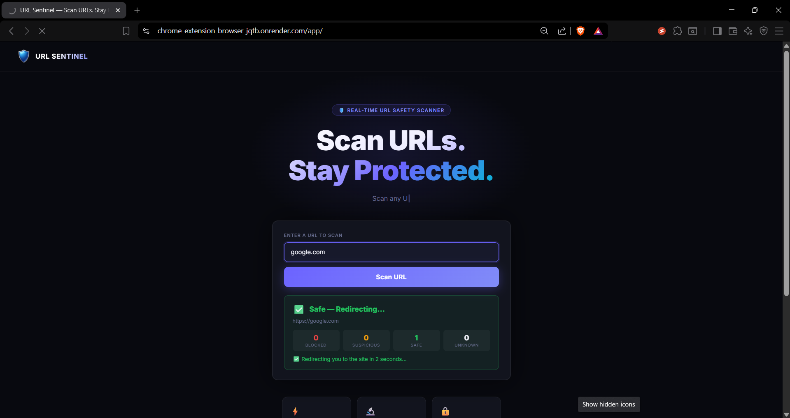
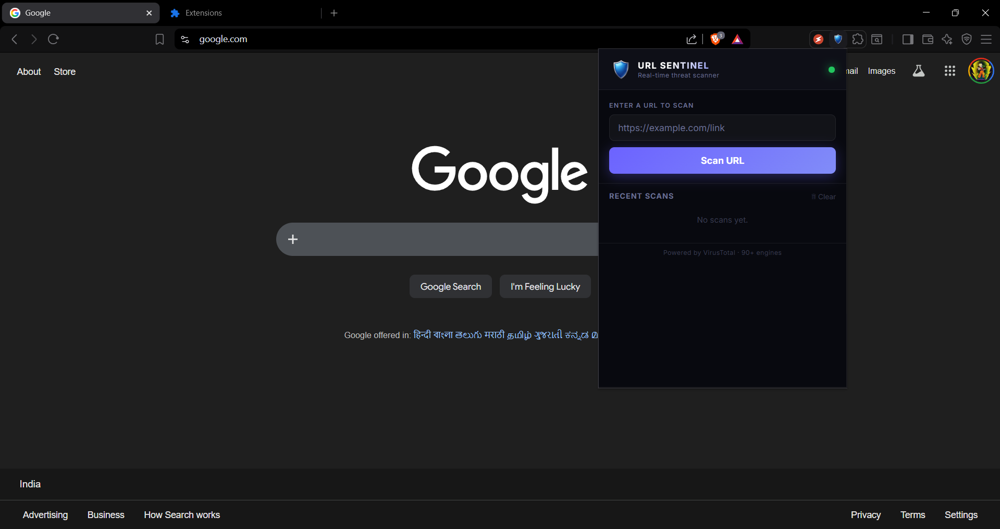
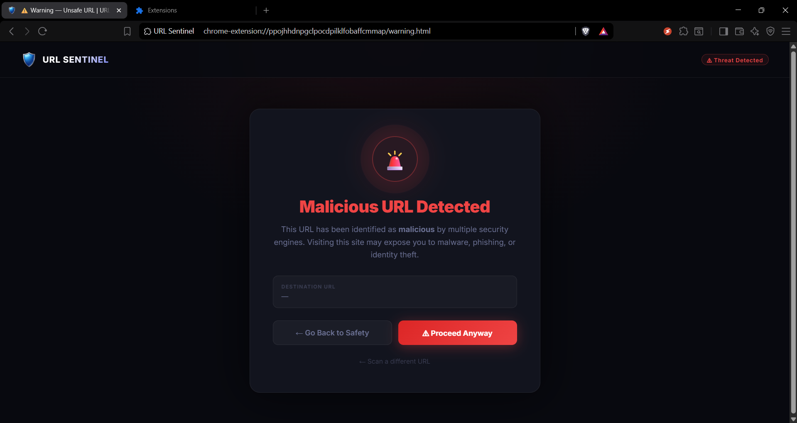
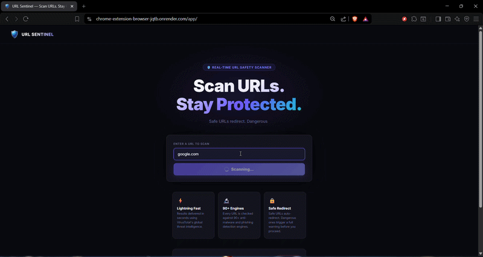
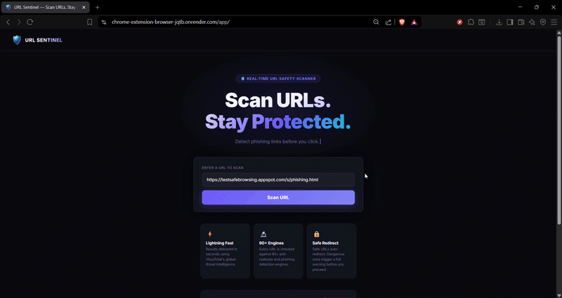
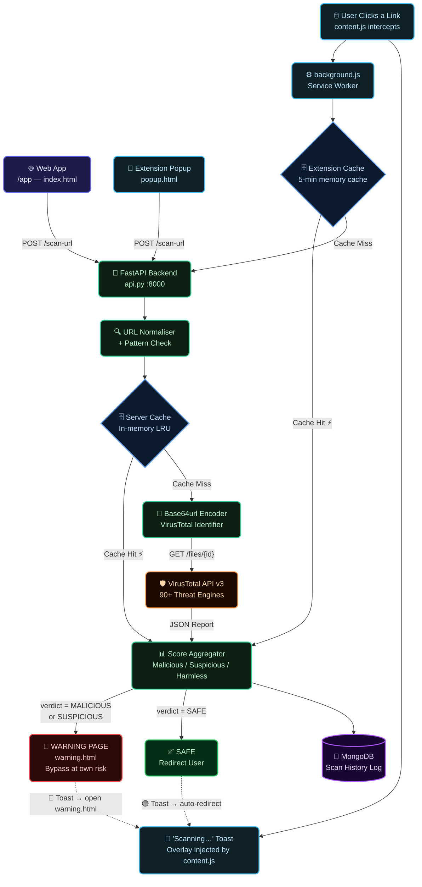

<div align="center">
  
  <h1>🛡️ URL Sentinel</h1>
  <p><strong>Real-time URL Safety Scanner & Link Interceptor</strong><br/><em>Scan URLs. Stay Protected.</em></p>
</div>

<p align="center">
  
  
  
  
  
</p>

<p align="center">
  <a href="https://chrome-extension-browser-jqtb.onrender.com/app" target="_blank">
    
  </a>
  &nbsp;
  <a href="https://chrome-extension-browser-jqtb.onrender.com/app" target="_blank">
    
  </a>
</p>

<p align="center">
  🔗 <strong><a href="https://chrome-extension-browser-jqtb.onrender.com/app">https://chrome-extension-browser-jqtb.onrender.com/app</a></strong>
</p>

---

URL Sentinel is a lightweight, blazing-fast security application designed to protect users from malicious, phishing, and scam links. It offers both a **Web Workspace** for manual URL analysis and a **Chrome Extension** that silently works in the background, intercepting your clicks and verifying link safety in real time against **90+ security engines**.

## 📸 Screenshots

*Screenshots of the project.*

| Web Interface | Scan Results |
|:---:|:---:|
|  |  |

| Chrome Extension Popup | Unsafe URL Warning Block |
|:---:|:---:|
|  |  |

---
*Short Implementation of the project.*
## 🎬 Demo

**✅ Safe URL — Auto Redirected**



**🚨 Malicious URL — Blocked & Warned**




## ✨ Key Features

- **Real-Time Click Interception:** (Chrome Extension) Captures every link you click. Before you navigate away, the link is scanned and verified.
- **Dynamic Warning System:** If a URL is categorized as *MALICIOUS*, *SUSPICIOUS*, or *UNKNOWN*, the extension halts navigation and presents a detailed warning page. Safe URLs redirect instantly.
- **90+ Threat Engines:** Powered by the VirusTotal API v3, cross-referencing your URL against top-tier cybersecurity vendors globally.
- **Smart Result Caching:** The backend heavily caches results to eliminate duplicate scans and achieve near-instantaneous load times (responses between 0.5s – 3.0s).
- **History Tracking & Analytics:** Logs scanned links directly to MongoDB, preserving a historical timeline of interactions.
- **Custom API Key Management:** Built-in endpoints to generate and manage developer keys for external integrations, including request limitations.

---

## 🛠️ Tech Stack

### Backend
- **Framework:** FastAPI (Python)
- **Database:** MongoDB (PyMongo)
- **External Integration:** VirusTotal REST API v3
- **Deployment:** Docker & Docker Compose (Render)

### Web App (Frontend)
- **Framework:** Vanilla HTML5, CSS3, ES6 JavaScript
- **Design:** Modern glassmorphic dark theme, CSS animations
- **Routing:** Served directly via FastAPI StaticFiles (`/app`)

### Chrome Extension
- **Platform:** Chrome Extension Manifest V3 (MV3)
- **Components:**
  - `background.js`: Service worker handling API routing & request caching.
  - `content.js`: Injected script tracking clicks and rendering "Scanning" inline toasts.
  - `popup.html`: Quick-access scanning dashboard right from the browser toolbar.
  - `warning.html`: Full-scale diversion page for unsafe links.

---

## 🏗️ System Architecture



> **Two paths, one goal — keeping you safe.**
>
> | Path | Entry | Decision |
> |------|-------|----------|
> | 🌐 **Web / Popup** | User pastes URL → clicks *Scan* | Result card rendered inline |
> | 🖱️ **Click Interception** | `content.js` intercepts click | Toast updates → redirect or block |

---

## 📂 Project Structure

```bash
📦 URL-Sentinel
├── 📄 api.py                  # Main FastAPI Application
├── 📄 Dockerfile              # Docker settings for Render deployment
├── 📄 docker-compose.yml      # Local dev environment
├── 📄 requirements.txt        # Python dependency list
├── 📂 frontend/               # Web Application
│   ├── 📄 index.html          # Landing Page
│   ├── 📄 script.js           # Web logic (API connection)
│   ├── 📄 style.css           # Web styles
│   └── 📄 warning.html        # Web Warning screen
├── 📂 extension/              # Chrome Extension (MV3)
│   ├── 📄 manifest.json       # Permissions and configs
│   ├── 📄 background.js       # Core service worker + cache
│   ├── 📄 content.js          # Click interceptor
│   ├── 📄 content.css         # Toast overlay styles
│   ├── 📄 popup.html/js/css   # UI for extension
│   └── 📄 warning.html/js/css # Extension Warning screen
└── 📂 assets/                 # Shared images, icons, and logos
```

---

## 🚀 Getting Started

### Prerequisites
- Python 3.10+
- MongoDB instance (Local or Atlas)
- VirusTotal API key

### Local Setup (Backend + Web)

1. **Clone the repository:**
   ```bash
   git clone https://github.com/parthib-ui/Chrome-Extension-Browser-.git
   cd Chrome-Extension-Browser-
   ```

2. **Environment Variables:**
   Create a `.env` file in the root directory:
   ```env
   MONGO_URL=mongodb+srv://<user>:<password>@cluster0...
   VIRUS_API_KEY=<your_virustotal_api_key>
   ```

3. **Install Dependencies:**
   ```bash
   pip install -r requirements.txt
   ```

4. **Run the Server:**
   ```bash
   uvicorn api:app --reload --host 0.0.0.0 --port 8000
   ```
   *Web interface will be available at: `http://localhost:8000/app`*

### Installing the Chrome Extension

1. Open Google Chrome and type `chrome://extensions/` in the URL bar.
2. Toggle **Developer mode** on (top right corner).
3. Click the **Load unpacked** button.
4. Navigate to your project directory and select the `extension/` folder.
5. Pin the URL Sentinel extension to your toolbar. You're now protected 24/7!

---

## 🛡️ License & Credits
- Made with ❤️ by **Parthib Ghosh**
- Powered by the [VirusTotal API](https://www.virustotal.com/)
